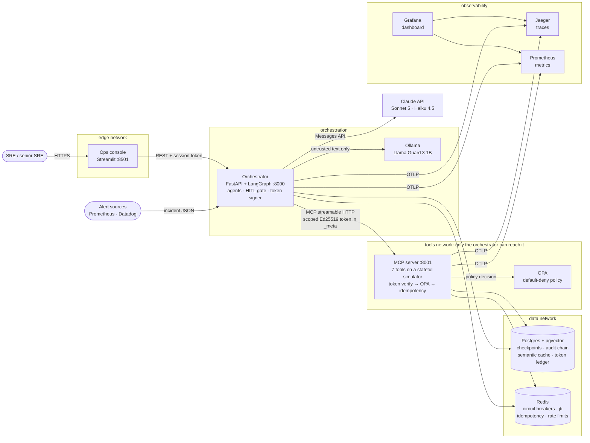

# C4 Level 2: Container view

What runs, how the containers talk, and where the trust boundaries are. Each dashed box is a Docker network: a container can only reach the containers it shares a network with.

| Boundary | What enforces it |
|---|---|
| Browser → system | Session token (HS256, 8 h), role check on every route (`orchestrator/auth.py`) |
| Agent → tools | Single-use, step-bound Ed25519 exec token + OPA default deny + strict arg schemas (`mcp_server/enforcement.py`, `opa/policies/mcp.rego`) |
| Anything → audit history | `audit_writer` role has INSERT/SELECT only; triggers block UPDATE/DELETE/TRUNCATE even for the owner (`common/sql/001_core.sql`) |
| Untrusted text → LLM | Scrubber, heuristics, Llama Guard, `<incident_data>` tagging (`common/safety/`) |

**Prototype vs production.** In the prototype the orchestrator also holds the token-signing key (ADR-005). Internal hops are plain HTTP inside isolated Docker networks; in the cloud reference a service mesh adds mTLS (ADR-007).
