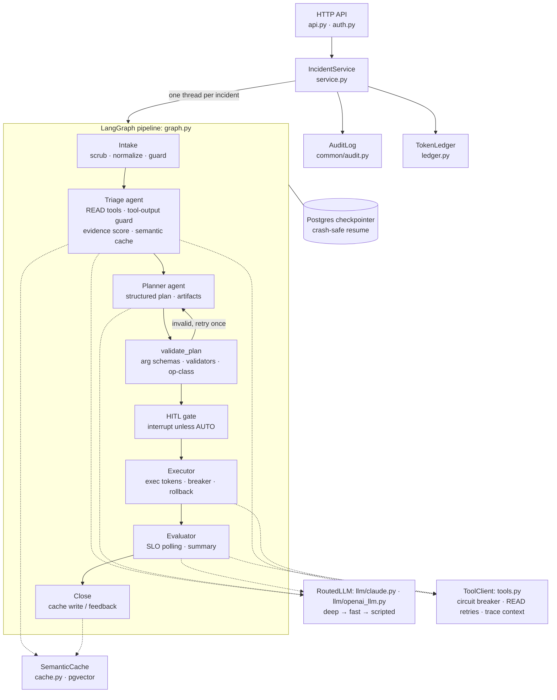

# C4 Level 3: Orchestrator components

The agent pipeline is a LangGraph `StateGraph` with a hierarchical topology. The supervisor is the routing code between nodes: deterministic, with no LLM. Only Triage, Planner and the Evaluator's summary call an LLM.

| Component | Responsibility | Key file |
|---|---|---|
| IncidentService | Starts and resumes graph runs, streams every node's events into the audit log and ledger, resumes in-flight runs after a restart | `orchestrator/service.py` |
| Gate | Pure, deterministic evaluation from `gate_policy.yaml`; safe to re-run on resume | `common/gate.py` |
| ToolClient | The anti-corruption layer between plan steps and MCP calls | `orchestrator/tools.py` |
| Guard | Heuristics first, Llama Guard only on suspicious windows, fail-closed on high-risk cues | `common/safety/llama_guard.py` |
