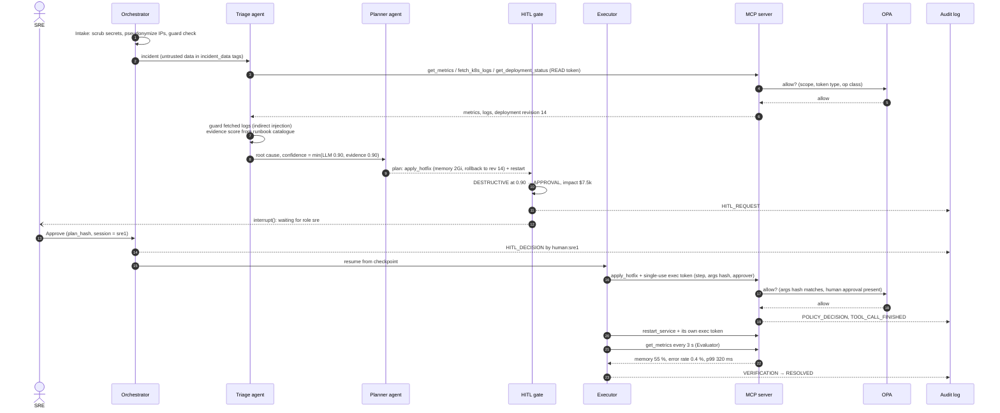

# Agent sequence: an approved destructive fix (scenario s01)

The OOMKilled `orders-service` incident: a memory hotfix plus restart. The hotfix is destructive, so the gate stops for an SRE.

If the restart fails instead (`scripts/fault.py inject restart_service 1`), the circuit breaker opens. The Executor then rolls back the completed hotfix with its pre-approved `rollback_deployment` token, and the incident ends `ESCALATED`.
