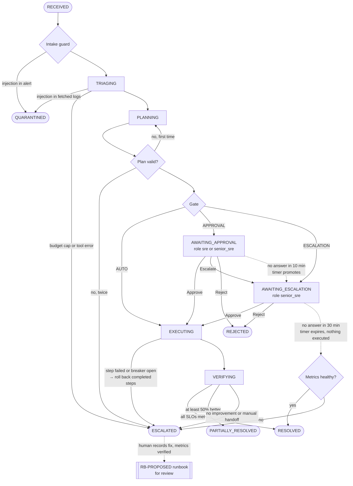

# Incident state machine and HITL gate

**Timeouts never approve.** Dotted edges are the timer (`system:hitl-timer`) and the learning path. Every ESCALATED incident has a hand-off summary (`GET /incidents/{id}/handoff`) that says what changed, if anything. Demo timers: 2 min / 4 min (`HITL_PROMOTE_AFTER_S`, `HITL_EXPIRE_AFTER_S`).

## Gate rules (`src/cloudscale/common/gate_policy.yaml`)

Confidence = `min(LLM confidence, evidence score)`. Tiers are half-open, so 0.80 is "≥ 0.80".

| Operation class | ≥ 0.80 | 0.60–0.80 | 0.40–0.60 | < 0.40 |
|---|---|---|---|---|
| READ | AUTO | AUTO | AUTO | AUTO |
| SAFE_MUTATION (`clear_pod_cache`) | AUTO | AUTO | APPROVAL | ESCALATION |
| DISRUPTIVE (`restart_service`) | AUTO | APPROVAL | APPROVAL | ESCALATION |
| DESTRUCTIVE (hotfix, rollback) | APPROVAL | APPROVAL | ESCALATION | ESCALATION |
| MANUAL runbook | ESCALATION | ESCALATION | ESCALATION | ESCALATION |

Overrides can only raise the gate:

| Trigger | Effect |
|---|---|
| **Financial impact** (revenue per minute × disruption minutes) above $10k / $50k | APPROVAL / ESCALATION |
| **Policy violation** (OPA deny, plan invalid twice) | ESCALATION |
| Critical alert (e.g. AZ partition), decided in code, never by the LLM | ESCALATION |
| Confidence below 0.60 | at least APPROVAL |
| Guard degraded (Llama Guard unavailable) | at least APPROVAL |
| LLM's destructive flag disagrees with the computed op class | at least APPROVAL |
| Destructive step without a rollback | ESCALATION |
| Diagnosis came from the semantic cache | confidence capped at 0.79 |

The plan's gate is its most restrictive step. An approval is bound to the exact plan version (`plan_hash`); a stale approval is refused with 409.
