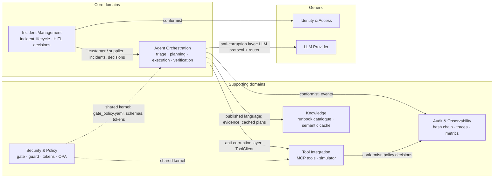

# DDD: Bounded contexts and context map

**Rubric:** Contract Compliance (domain alignment: Core vs Supporting, agent capabilities mapped to contexts)

## Context map

## Contexts → code → agents

| Context | Type | Code | Aggregates / key objects | Agent capabilities in this context |
|---|---|---|---|---|
| **Incident Management** | Core | `orchestrator/api.py`, `service.py`, `store.py` | **Incident** (root), HITL Decision (bound to `plan_hash`) | Human decisions; the supervisor's lifecycle states |
| **Agent Orchestration** | Core | `orchestrator/graph.py`, `llm/` | Agent run (one LangGraph thread), Triage result, Remediation plan | **Triage**, **Planner**, **Executor**, **Evaluator**, supervisor routing |
| **Tool Integration** | Supporting | `mcp_server/`, ACL in `orchestrator/tools.py` | Tool invocation (idempotency key, args hash) | Executor's and Triage's tool calls |
| **Security & Policy** | Supporting · shared kernel | `common/gate.py`, `common/safety/`, `common/tokens.py`, `opa/` | Gate policy, guard result, exec token | The gate; guard checks on every untrusted input |
| **Audit & Observability** | Supporting | `common/audit.py`, `common/telemetry.py`, `ledger.py` | Audit entry (append-only), token usage row | Every agent emits events; none can edit history |
| **Knowledge** | Supporting | `common/runbooks.yaml`, `orchestrator/cache.py` | Runbook, cache entry (verified only) | Triage's evidence score; plan reuse |
| Identity & Access | Generic | `orchestrator/auth.py` | User, role | — |
| LLM Provider | Generic | `llm/claude.py`, `llm/scripted.py` | — | Model routing and failover behind one protocol |

## Why these boundaries
- **Incident Management vs Agent Orchestration.** A human decision is an Incident Management fact; the agent pipeline only consumes it. That's why the approver comes from the session in the API and never from the agent's state.
- **Tool Integration behind an ACL.** Plan steps (our domain language) are translated to MCP calls in one place, so swapping the simulator for real Kubernetes/cloud adapters doesn't touch the agents.
- **Security & Policy as a shared kernel.** The gate and OPA must agree exactly, so they share one policy file and one set of schemas rather than two copies that could drift.
